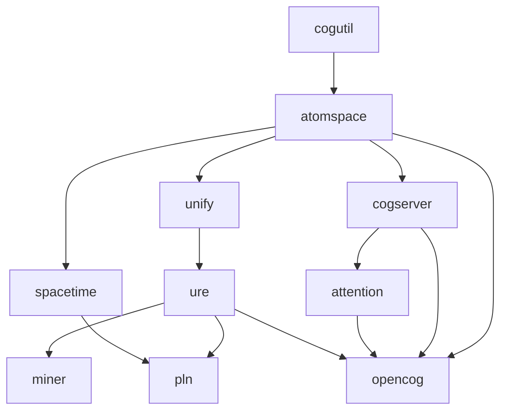
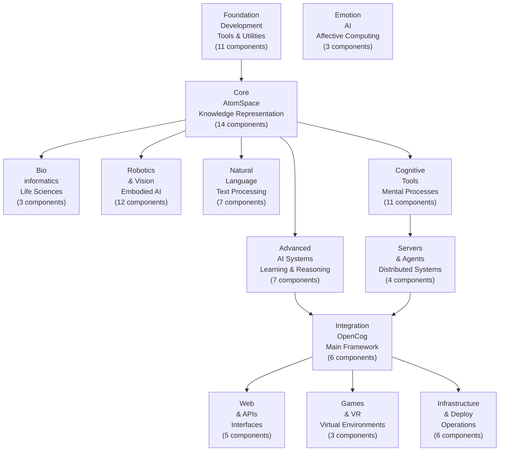

# CogBuilder

## OpenCog Central Dependency Diagrams

This document contains comprehensive dependency diagrams for the OpenCog Central ecosystem,
generated from README specifications and CMakeLists.txt analysis.

## Complete Dependency Diagram

Shows all components and their dependencies across the entire ecosystem:

```mermaid
graph TD
    %% OpenCog Central Complete Dependency Diagram

    %% Styling
    classDef foundation fill:#e8f5e8,stroke:#4caf50,stroke-width:2px
    classDef core fill:#e3f2fd,stroke:#2196f3,stroke-width:2px
    classDef logic fill:#fff3e0,stroke:#ff9800,stroke-width:2px
    classDef cognitive fill:#f3e5f5,stroke:#9c27b0,stroke-width:2px
    classDef advanced fill:#ffebee,stroke:#f44336,stroke-width:2px
    classDef learning fill:#f1f8e9,stroke:#8bc34a,stroke-width:2px
    classDef specialized fill:#e0f2f1,stroke:#009688,stroke-width:2px
    classDef integration fill:#fce4ec,stroke:#e91e63,stroke-width:2px

    %% Node definitions
    cheminformatics["cheminformatics"]
    semantic_vision["semantic<br/>vision"]
    pi_vision["pi<br/>vision"]
    vision["vision"]
    sensory["sensory"]
    visualization["visualization"]
    agi_bio["agi<br/>bio"]
    pau2motors["pau2motors"]
    perception["perception"]
    ros_behavior_scripting["ros<br/>behavior<br/>scripting"]
    robots_config["robots<br/>config"]
    loving_ai_ghost["loving<br/>ai<br/>ghost"]
    loving_ai["loving<br/>ai"]
    ghost_bridge["ghost<br/>bridge"]
    relex["relex"]
    linkgrammar_relex_web["linkgrammar<br/>relex<br/>web"]
    stochastic_language_generation["stochastic<br/>language<br/>generation"]
    link_grammar["link<br/>grammar"]
    lg_atomese["lg<br/>atomese"]
    link_grammar_website["link<br/>grammar<br/>website"]
    TinyCog["TinyCog"]
    pln_brca_xp["pln<br/>brca<br/>xp"]
    benchmark["benchmark"]
    miner["miner"]
    pln["pln"]
    destin["destin"]
    cogutil["cogutil"]
    blender_api_msgs["blender<br/>api<br/>msgs"]
    blender_api["blender<br/>api"]
    asmoses["asmoses"]
    moses["moses"]
    ocpkg["ocpkg"]
    rust_crates["rust<br/>crates"]
    external_tools["external<br/>tools"]
    cogprotolab["cogprotolab"]
    src["src"]
    integrated_output["integrated<br/>output"]
    guile_dbi["guile<br/>dbi"]
    test_datasets["test<br/>datasets"]
    node_modules["node<br/>modules"]
    opencog_rpi["opencog<br/>rpi"]
    ros_opencog_robot_embodiment["ros<br/>opencog<br/>robot<br/>embodiment"]
    unity3d_opencog_game["unity3d<br/>opencog<br/>game"]
    opencog_to_minecraft["opencog<br/>to<br/>minecraft"]
    opencog_nix["opencog<br/>nix"]
    opencog["opencog"]
    opencog_cycl["opencog<br/>cycl"]
    opencog_neo4j["opencog<br/>neo4j"]
    opencog_debian["opencog<br/>debian"]
    opencog_org["opencog.org"]
    rest_api_documentation["rest<br/>api<br/>documentation"]
    python_client["python<br/>client"]
    python_destin["python<br/>destin"]
    python_attic["python<br/>attic"]
    python_packages["python<br/>packages"]
    docs["docs"]
    docker["docker"]
    copied_yml["copied<br/>yml"]
    copied_scm["copied<br/>scm"]
    scripts["scripts"]
    copied_cmake["copied<br/>cmake"]
    language_learning["language<br/>learning"]
    generate["generate"]
    learn["learn"]
    atomspace_agents["atomspace<br/>agents"]
    atomspace_dht["atomspace<br/>dht"]
    atomspace["atomspace"]
    atomspace_rocks["atomspace<br/>rocks"]
    atomspace_ipfs["atomspace<br/>ipfs"]
    atomspace_websockets["atomspace<br/>websockets"]
    atomspace_restful["atomspace<br/>restful"]
    atomspace_typescript["atomspace<br/>typescript"]
    atomspace_explorer["atomspace<br/>explorer"]
    atomspace_js["atomspace<br/>js"]
    atomspace_bridge["atomspace<br/>bridge"]
    atomspace_metta["atomspace<br/>metta"]
    atomspace_rpc["atomspace<br/>rpc"]
    atomspace_cog["atomspace<br/>cog"]
    agents["agents"]
    attention["attention"]
    spacetime["spacetime"]
    logicmoo_cogserver["logicmoo<br/>cogserver"]
    cogserver["cogserver"]
    pattern_index["pattern<br/>index"]
    tv_toolbox["tv<br/>toolbox"]
    kokkos_integrations["kokkos<br/>integrations"]
    dimensional_embedding["dimensional<br/>embedding"]
    distributional_value["distributional<br/>value"]
    profile["profile"]
    rocca["rocca"]
    unify["unify"]
    ure["ure"]

    %% Dependencies
    atomspace --> cheminformatics
    cogutil --> cheminformatics
    atomspace --> agi_bio
    cogutil --> agi_bio
    boost --> cogutil
    doxygen --> cogutil
    gnubacktrace --> cogutil
    iberty --> cogutil
    parallelstl --> cogutil
    cxxtest --> cogutil
    pthreads --> cogutil
    bfd --> cogutil
    stlport --> cogutil
    ure --> benchmark
    boost --> benchmark
    atomspace --> benchmark
    cogutil --> benchmark
    boost --> blender_api_msgs
    catkin --> blender_api_msgs
    boost --> pau2motors
    catkin --> pau2motors
    boost --> perception
    catkin --> perception
    catkin --> ros_behavior_scripting
    catkin --> robots_config
    doxygen --> vision
    valgrind --> vision
    catch2 --> vision
    opencv --> vision
    cogutil --> vision
    atomspace --> vision
    atomspace --> sensory
    cogutil --> sensory
    boost --> ghost_bridge
    catkin --> ghost_bridge
    doxygen --> python_attic
    attentionbank --> python_attic
    uuid --> python_attic
    valgrind --> python_attic
    cxxtest --> python_attic
    cogserver --> python_attic
    cogutil --> python_attic
    ghc --> python_attic
    stack --> python_attic
    linkgrammar --> python_attic
    guile --> python_attic
    pln --> python_attic
    atomspace --> python_attic
    ure --> python_attic
    doxygen --> lg_atomese
    cxxtest --> lg_atomese
    linkgrammar --> lg_atomese
    cogutil --> lg_atomese
    uuid --> lg_atomese
    atomspace --> lg_atomese
    boost --> atomspace_agents
    doxygen --> atomspace_agents
    valgrind --> atomspace_agents
    cxxtest --> atomspace_agents
    cogutil --> atomspace_agents
    atomspace --> atomspace_agents
    doxygen --> atomspace_dht
    cxxtest --> atomspace_dht
    atomspace --> atomspace_dht
    cogutil --> atomspace_dht
    boost --> atomspace
    doxygen --> atomspace
    pgsql --> atomspace
    unixodbc --> atomspace
    valgrind --> atomspace
    cxxtest --> atomspace
    cogutil --> atomspace
    stack --> atomspace
    folly --> atomspace
    ocaml --> atomspace
    doxygen --> atomspace_rocks
    valgrind --> atomspace_rocks
    cxxtest --> atomspace_rocks
    rocksdb --> atomspace_rocks
    cogutil --> atomspace_rocks
    atomspace --> atomspace_rocks
    doxygen --> atomspace_ipfs
    cxxtest --> atomspace_ipfs
    atomspace --> atomspace_ipfs
    cogutil --> atomspace_ipfs
    boost --> atomspace_websockets
    cxxtest --> atomspace_websockets
    atomspace --> atomspace_websockets
    cogutil --> atomspace_websockets
    boost --> atomspace_restful
    doxygen --> atomspace_restful
    attentionbank --> atomspace_restful
    jsoncpp --> atomspace_restful
    cxxtest --> atomspace_restful
    cogserver --> atomspace_restful
    cogutil --> atomspace_restful
    zmq --> atomspace_restful
    pkgconfig --> atomspace_restful
    tbb --> atomspace_restful
    atomspace --> atomspace_restful
    doxygen --> atomspace_bridge
    pgsql --> atomspace_bridge
    valgrind --> atomspace_bridge
    cxxtest --> atomspace_bridge
    cogutil --> atomspace_bridge
    atomspace --> atomspace_bridge
    doxygen --> atomspace_metta
    cxxtest --> atomspace_metta
    atomspace --> atomspace_metta
    cogutil --> atomspace_metta
    boost --> atomspace_rpc
    cxxtest --> atomspace_rpc
    atomspace --> atomspace_rpc
    cogutil --> atomspace_rpc
    doxygen --> atomspace_cog
    valgrind --> atomspace_cog
    cxxtest --> atomspace_cog
    cogserver --> atomspace_cog
    cogutil --> atomspace_cog
    atomspace --> atomspace_cog
    cxxtest --> generate
    atomspace --> generate
    cogutil --> generate
    boost --> pattern_index
    doxygen --> pattern_index
    cxxtest --> pattern_index
    cogutil --> pattern_index
    atomspace --> pattern_index
    boost --> attention
    doxygen --> attention
    valgrind --> attention
    cxxtest --> attention
    cogserver --> attention
    cogutil --> attention
    atomspace --> attention
    boost --> dimensional_embedding
    doxygen --> dimensional_embedding
    cxxtest --> dimensional_embedding
    cogutil --> dimensional_embedding
    atomspace --> dimensional_embedding
    boost --> spacetime
    doxygen --> spacetime
    cxxtest --> spacetime
    octomap --> spacetime
    cogutil --> spacetime
    atomspace --> spacetime
    boost --> unify
    valgrind --> unify
    cxxtest --> unify
    cogutil --> unify
    atomspace --> unify
    boost --> visualization
    doxygen --> visualization
    cogutil --> visualization
    gtk3 --> visualization
    atomspace --> visualization
    festival --> TinyCog
    openmp --> TinyCog
    est --> TinyCog
    opencv --> TinyCog
    wiringpi --> TinyCog
    raspicam --> TinyCog
    alsa --> TinyCog
    guile --> TinyCog
    pkgconfig --> TinyCog
    pocketsphinx --> TinyCog
    dlib --> TinyCog
    protobuf --> TinyCog
    atomspace --> TinyCog
    doxygen --> opencog
    attention --> opencog
    attentionbank --> opencog
    valgrind --> opencog
    cxxtest --> opencog
    cogserver --> opencog
    cogutil --> opencog
    ghc --> opencog
    stack --> opencog
    lgatomese --> opencog
    pln --> opencog
    atomspace --> opencog
    ure --> opencog
    boost --> miner
    valgrind --> miner
    unify --> miner
    cxxtest --> miner
    cogutil --> miner
    atomspace --> miner
    ure --> miner
    boost --> asmoses
    doxygen --> asmoses
    valgrind --> asmoses
    cxxtest --> asmoses
    cogutil --> asmoses
    mpi --> asmoses
    atomspace --> asmoses
    ure --> asmoses
    boost --> ure
    valgrind --> ure
    unify --> ure
    cxxtest --> ure
    cogutil --> ure
    atomspace --> ure
    cogserver --> learn
    atomspace --> learn
    cogutil --> learn
    unify --> pln
    spacetime --> pln
    cxxtest --> pln
    cogutil --> pln
    atomspace --> pln
    ure --> pln
    boost --> moses
    doxygen --> moses
    valgrind --> moses
    cxxtest --> moses
    cogutil --> moses
    mpi --> moses
    boost --> cogserver
    doxygen --> cogserver
    valgrind --> cogserver
    cxxtest --> cogserver
    openssl --> cogserver
    cogutil --> cogserver
    atomspace --> cogserver
    cogutil --> relex

    %% Apply styles
    class cheminformatics specialized
    class semantic_vision specialized
    class pi_vision specialized
    class vision specialized
    class sensory specialized
    class visualization specialized
    class agi_bio specialized
    class pau2motors specialized
    class perception specialized
    class ros_behavior_scripting specialized
    class robots_config specialized
    class loving_ai_ghost specialized
    class loving_ai specialized
    class ghost_bridge specialized
    class relex specialized
    class linkgrammar_relex_web specialized
    class stochastic_language_generation specialized
    class link_grammar specialized
    class lg_atomese specialized
    class link_grammar_website specialized
    class TinyCog specialized
    class pln_brca_xp advanced
    class benchmark advanced
    class miner advanced
    class pln advanced
    class destin advanced
    class cogutil foundation
    class blender_api_msgs foundation
    class blender_api foundation
    class asmoses foundation
    class moses foundation
    class ocpkg foundation
    class rust_crates foundation
    class external_tools foundation
    class cogprotolab foundation
    class src foundation
    class integrated_output foundation
    class guile_dbi foundation
    class test_datasets foundation
    class node_modules foundation
    class opencog_rpi integration
    class ros_opencog_robot_embodiment integration
    class unity3d_opencog_game integration
    class opencog_to_minecraft integration
    class opencog_nix integration
    class opencog integration
    class opencog_cycl integration
    class opencog_neo4j integration
    class opencog_debian integration
    class opencog_org integration
    class rest_api_documentation integration
    class python_client integration
    class python_destin integration
    class python_attic integration
    class python_packages packaging
    class docs packaging
    class docker packaging
    class copied_yml packaging
    class copied_scm packaging
    class scripts packaging
    class copied_cmake packaging
    class language_learning learning
    class generate learning
    class learn learning
    class atomspace_agents core
    class atomspace_dht core
    class atomspace core
    class atomspace_rocks core
    class atomspace_ipfs core
    class atomspace_websockets core
    class atomspace_restful core
    class atomspace_typescript core
    class atomspace_explorer core
    class atomspace_js core
    class atomspace_bridge core
    class atomspace_metta core
    class atomspace_rpc core
    class atomspace_cog core
    class agents core
    class attention cognitive
    class spacetime cognitive
    class logicmoo_cogserver cognitive
    class cogserver cognitive
    class pattern_index cognitive
    class tv_toolbox cognitive
    class kokkos_integrations cognitive
    class dimensional_embedding cognitive
    class distributional_value cognitive
    class profile cognitive
    class rocca cognitive
    class unify logic
    class ure logic
```

## Critical Build Path

Shows the critical path through core components that define the build order:

## Category Overview

High-level view of functional categories and their relationships:

## Build Order Timeline

Timeline showing parallel build opportunities and sequential dependencies:

```mermaid
gantt
    title OpenCog Central Build Timeline
    dateFormat X
    axisFormat %s

    section Foundation
    cogutil :cogutil, 0, 100
    moses :moses, 0, 100
    section Core
    atomspace :atomspace, 100, 200
    atomspace-rocks :atomspace-rocks, 100, 200
    atomspace-restful :atomspace-restful, 100, 200
    section Logic
    unify :unify, 200, 250
    ure :ure, 200, 250
    section Cognitive
    cogserver :cogserver, 250, 350
    attention :attention, 250, 350
    spacetime :spacetime, 250, 350
    section Advanced
    pln :pln, 350, 450
    miner :miner, 350, 450
    asmoses :asmoses, 350, 450
    section Learning
    learn :learn, 450, 500
    generate :generate, 450, 500
    section Language
    lg-atomese :lg-atomese, 300, 400
    relex :relex, 300, 400
    link-grammar :link-grammar, 300, 400
    section Robotics
    vision :vision, 300, 400
    perception :perception, 300, 400
    sensory :sensory, 300, 400
    section Integration
    opencog :opencog, 500, 600
    section Packaging
    opencog-debian :opencog-debian, 600, 650
    opencog-nix :opencog-nix, 600, 650
```

---

*Generated automatically from 42 components*  
*Last updated: 2025-06-16*
